# Terminal Setup Style by Angel-T Dev 🚀

¡Transforma la aburrida terminal por defecto de Visual Studio Code en una herramienta profesional, colorida y con iconos increíbles con un solo comando!

  

---

## 💎 Diseños Premium Dinámicos en la Nube
Para garantizar la máxima calidad en los diseños, los temas incluyen **múltiples estructuras arquitectónicas** (bordes redondeados, estilo powerline, diamantes, minimalista y rectos). Además, el motor de la extensión se conecta a la **nube** para descargar dinámicamente y en tiempo real las versiones más modernas y perfectas de cada estructura arquitectónica. Esto asegura que siempre tengas un estilo impecable, de alto rendimiento y actualizado.

---

<h3>🎨 Galería de Temas</h3>

<table align="center" width="100%">
  <tr>
    <td align="center" width="50%">
      <b>jandedobbeleer</b> 
      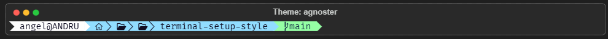
    </td>
    <td align="center" width="50%">
      <b>cyberpunk</b> 
      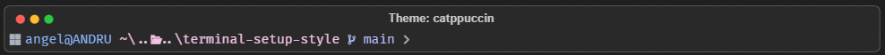
    </td>
  </tr>
  <tr>
    <td align="center">
      <b>dracula</b> 
      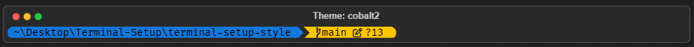
    </td>
    <td align="center">
      <b>hacker</b> 
      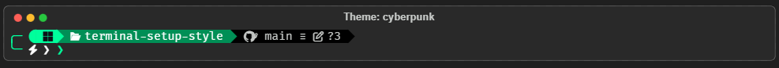
    </td>
  </tr>
  <tr>
    <td align="center">
      <b>tokyonight_storm</b> 
      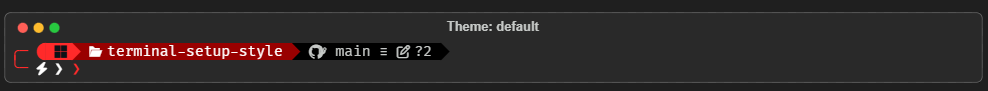
    </td>
    <td align="center">
      <b>monokai</b> 
      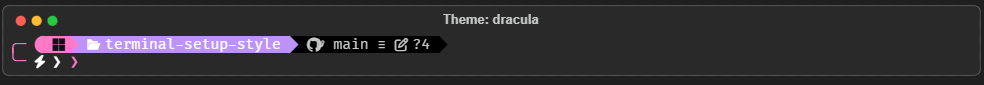
    </td>
  </tr>
  <tr>
    <td align="center">
      <b>blue-owl</b> 
      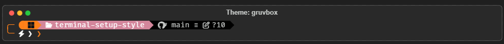
    </td>
    <td align="center">
      <b>synthwave</b> 
      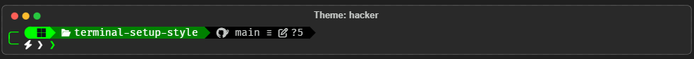
    </td>
  </tr>
  <tr>
    <td align="center">
      <b>gruvbox</b> 
      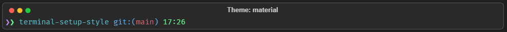
    </td>
    <td align="center">
      <b>minimal</b> 
      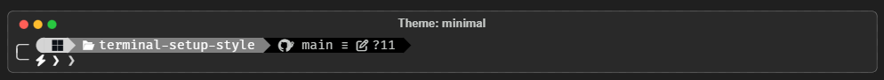
    </td>
  </tr>
  <tr>
    <td align="center">
      <b>catppuccin_mocha</b> 
      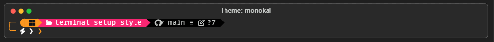
    </td>
    <td align="center">
      <b>cobalt2</b> 
      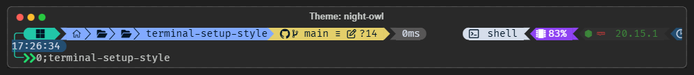
    </td>
  </tr>
  <tr>
    <td align="center">
      <b>night-owl</b> 
      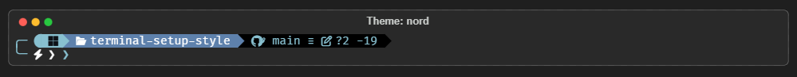
    </td>
    <td align="center">
      <b>nord</b> 
      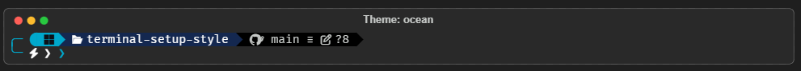
    </td>
  </tr>
  <tr>
    <td align="center">
      <b>agnoster</b> 
      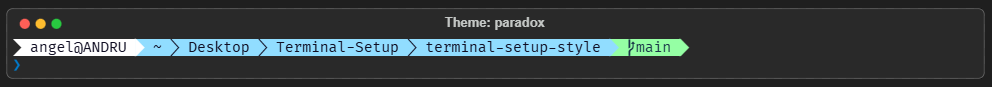
    </td>
    <td align="center">
      <b>material</b> 
      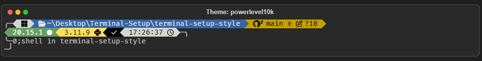
    </td>
  </tr>
  <tr>
    <td align="center">
      <b>spaceship</b> 
      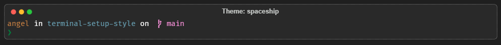
    </td>
    <td align="center">
      <b>powerlevel10k_rainbow</b> 
      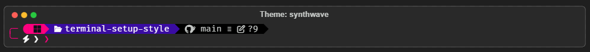
    </td>
  </tr>
  <tr>
    <td align="center" colspan="2" width="50%">
      <b>paradox</b> 
      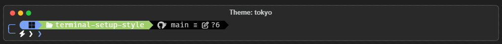
    </td>
  </tr>
</table>

---

## ✨ Características

* **Instalación de 1 Clic:** Olvídate de configuraciones largas en PowerShell. La extensión hace todo el trabajo pesado.
* **Motor Oh My Posh:** Inyecta un diseño visual moderno y fácil de leer directamente en tu editor.
* **Iconografía Avanzada:** Soporte total para iconos de carpetas, estado de Git y lenguajes de programación.
* **Integración Nativa:** Modifica automáticamente el `settings.json` de VS Code para aplicar la fuente correcta sin que tengas que buscarla.

## 📋 Requisitos Previos

¡Buenas noticias! A partir de la versión **0.0.7**, la extensión **descarga e instala automáticamente** las fuentes necesarias (*FiraCode Nerd Font* y *CaskaydiaCove Nerd Font*) en tu perfil de usuario (sin requerir permisos de administrador). 

*Nota: Solo si experimentas algún fallo en la descarga automática, puedes instalarlas manualmente desde la página de [Nerd Fonts](https://www.nerdfonts.com/).*

## 🚀 Cómo Usarla

1. Abre Visual Studio Code.
2. Abre la Paleta de Comandos presionando `Ctrl` + `Shift` + `P`.
3. Escribe y selecciona el comando: **`Angel-T Dev: Instalar Terminal Setup`**.
4. ¡Espera el mensaje de éxito, abre una nueva terminal y disfruta tu nuevo entorno!

## ⚙️ Personalización (Configuración)

Esta extensión utiliza la interfaz nativa de configuración de Visual Studio Code para que puedas modificar tus parámetros de forma integrada y sin complicaciones:

1. Abre la configuración de VS Code presionando `Ctrl` + `,` (o ve a *Archivo > Preferencias > Configuración*).
2. En la barra de búsqueda superior, escribe: **`Terminal Setup Style`**.
3. Verás los campos de personalización listos para ser editados:
   * **Nombre**: El nombre que se mostrará en tu prompt de PowerShell.
   * **Fuente**: El nombre de tu Nerd Font instalada.
   * **Tema**: Menú desplegable para seleccionar tu tema de Oh My Posh favorito.
   * **Color ASCII**: Menú desplegable para elegir el color del Arte ASCII de bienvenida (usa 'auto' para usar el del tema).
4. Modifica los valores. Se guardarán automáticamente de forma global en tu VS Code.
5. Abre la Paleta de Comandos (`Ctrl` + `Shift` + `P`) y ejecuta **`Angel-T Dev: Instalar Terminal Setup`** para aplicar e instalar la terminal con tu nueva configuración.

> 💡 **Tip:** ¿Quieres crear tus propias letras gigantes personalizadas para la terminal? Genera las tuyas usando [TAAG Generator (Font: ANSI Shadow)](https://patorjk.com/software/taag/#p=display&f=ANSI%20Shadow).

## 🛠️ Notas de Versión

### v0.1.11
* **Mega Expansión de Temas (19 Diseños)**: Se ha integrado una galería completa con **19 temas dinámicos premium**, incluyendo diseños oficiales (`catppuccin`, `dracula`, `nord`, etc.) y configuraciones personalizadas (`cyberpunk`, `tokyo`, `hacker`).
* **Galería Visual Optimizada**: Nueva tabla de visualización de dos columnas con capturas reales ultra-nítidas para que elijas tu estilo favorito sin sorpresas.
* **Separación Inteligente de Assets**: Organización optimizada de los recursos visuales en directorios de imágenes (`img/`) y vectores (`svg/`).

### v0.1.3
* **Diseños Premium Dinámicos**: Los temas ahora descargan sus estructuras arquitectónicas desde la nube.
* **Mejora del Instalador**: El script de PowerShell se integra completamente con los diseños.

### v0.1.2
* **Arte ASCII Dinámico**: Creación del generador ASCII al instante desde TS.

### v0.1.1 & v0.1.0
* **Automatización y Fix de Build**: Generación automática de vistas e historial.

### v0.0.17
* **Corrección de Visualización**: Se revirtió la ventana de terminal HTML por la Galería Markdown, ya que GitHub limpia el código CSS complejo por seguridad.

### v0.0.16
* **Ventana de Terminal Simulada**: Se incorporó (brevemente) una ventana de terminal simulada en HTML, aunque fue revertida por problemas de compatibilidad con GitHub.

### v0.0.15
* **Galería Visual de Temas**: Se agregó una simulación visual y galería de los 19 temas disponibles directamente en el `README.md` principal.

### v0.0.14
* **9 Nuevos Temas Inspirados**: Se integraron 9 temas nuevos (`catppuccin`, `cobalt2`, `night-owl`, `nord`, `agnoster`, `material`, `spaceship`, `powerlevel10k`, `paradox`).

### v0.0.13
* **Personalización Total de ASCII**: Nuevo ajuste en VS Code para cambiar dinámicamente el color del arte ASCII, y se añadió enlace al generador de letras en la documentación.

### v0.0.12
* **Documentación Histórica**: Reconstrucción y sincronización completa del historial de versiones desde el inicio del proyecto.

### v0.0.11
* **Sistema de Lanzamientos con IA**: Integración de una habilidad inteligente que automatiza la creación de notas de versión y sincroniza los archivos `.md`.

### v0.0.10
* **Auto-Arranque Inteligente**: El menú interactivo de temas se ejecuta automáticamente la primera vez que instalas la extensión, guiando al usuario de inmediato.

### v0.0.9
* **Sincronización Dinámica de Configuración**: Mejoras en la gestión dinámica de configuraciones desde `extension.ts` para aplicar temas instantáneamente sin recargar.

### v0.0.8 / v0.0.7
* **Menú Interactivo (QuickPick)**: Se agregó un menú desplegable para elegir el tema directamente al ejecutar el comando.
* **Generación Dinámica de Temas**: Ahora los archivos `.omp.json` se generan dinámicamente con los colores exactos seleccionados.
* **Descarga Automática de Fuentes**: Instalación de Nerd Fonts de forma silenciosa y sin permisos de administrador.

### v0.0.6 / v0.0.5
* **Comando de Instalación Integrado**: Implementación de la lógica principal para la sincronización de temas y la ejecución remota de instalación desde la terminal.

### v0.0.4 / v0.0.2
* **Mejoras Visuales e Integración**: Adición del logo oficial (`icon.png`) y optimización de la estructura. 
* Añadidas las configuraciones personalizadas al panel de VS Code (Nombre, Fuente y Tema).
* Creación del script `build-release.ps1` para un empaquetado y versionado automatizado.

### v0.0.1
* Lanzamiento inicial del repositorio.
* Conexión directa con el script instalador remoto de PowerShell pasando variables de entorno de manera segura.
* Soporte MIT Open Source y licencia oficial en el repositorio.

---

## 📄 Licencia

Este proyecto está bajo la Licencia **MIT**. Consulta el código fuente y úsalo libremente para tus desarrollos.

---
*Desarrollado con 💻 y ☕ por [Angel Eduardo Tarcaya](https://github.com/angeltarcayadev)*
