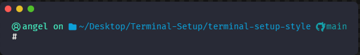
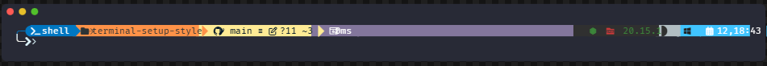
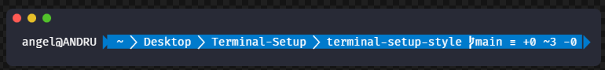
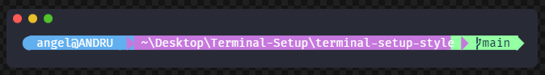
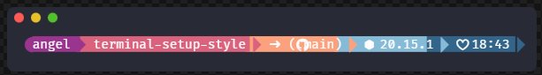
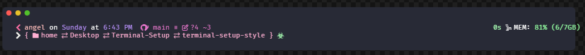
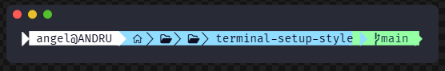
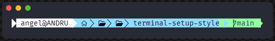

<h1 align="center">
  Terminal Setup Style
</h1>

  <i align="center">Prompt theme engine for your VS Code terminal ??</i>

  
  
  
  
  

  

## ?? Sponsors

  

[Want to become a sponsor?](https://github.com/sponsors/angeltarcayadev)

## ?? Join the community

  
  

---

What started as a simple script to customize PowerShell inside VS Code resulted in a highly customizable and extensible prompt theme engine. With **Terminal Setup Style**, you can effortlessly inject beautiful architectural designs, Nerd Fonts, and ASCII art directly into your VS Code integrated terminal.

### ?? Support ??

- [**Swag**](#) - Show your love with a t-shirt!
- [**GitHub**](https://github.com/sponsors/angeltarcayadev) - One time support, or a recurring donation?
- [**Ko-Fi**](#) - No coffee, no code.

---

## ? Features

- **Shell and platform agnostic**: Designed to work flawlessly in your VS Code terminal (PowerShell focus).
- **Easily configurable**: No more complex JSON editing, pick your style directly from VS Code settings.
- **The most configurable prompt utility**: Over 19+ premium themes ready to use, plus support for custom themes via the \	hemes/\ folder.
- **Fast**: Installs and configures everything locally with zero latency.
- **Dynamic ASCII Art**: Generate beautiful, colorful ASCII banners dynamically for your profile.

---

## ?? Galería de Temas

<table align="center" width="100%">
  <tr>
    <td align="center" width="50%">
      <b>jandedobbeleer</b> 
      
    </td>
    <td align="center" width="50%">
      <b>cyberpunk</b> 
      
    </td>
  </tr>
  <tr>
    <td align="center">
      <b>dracula</b> 
      
    </td>
    <td align="center">
      <b>hacker</b> 
      
    </td>
  </tr>
  <tr>
    <td align="center">
      <b>tokyonight_storm</b> 
      
    </td>
    <td align="center">
      <b>monokai</b> 
      
    </td>
  </tr>
  <tr>
    <td align="center">
      <b>blue-owl</b> 
      
    </td>
    <td align="center">
      <b>synthwave</b> 
      
    </td>
  </tr>
  <tr>
    <td align="center">
      <b>gruvbox</b> 
      
    </td>
    <td align="center">
      <b>minimal</b> 
      
    </td>
  </tr>
  <tr>
    <td align="center">
      <b>catppuccin_mocha</b> 
      
    </td>
    <td align="center">
      <b>cobalt2</b> 
      
    </td>
  </tr>
  <tr>
    <td align="center">
      <b>night-owl</b> 
      
    </td>
    <td align="center">
      <b>nord</b> 
      
    </td>
  </tr>
  <tr>
    <td align="center">
      <b>agnoster</b> 
      
    </td>
    <td align="center">
      <b>material</b> 
      
    </td>
  </tr>
  <tr>
    <td align="center">
      <b>spaceship</b> 
      
    </td>
    <td align="center">
      <b>powerlevel10k_rainbow</b> 
      
    </td>
  </tr>
  <tr>
    <td align="center">
      <b>paradox</b> 
      
    </td>
    <td align="center">
      <b>custom_pastel</b> 
      
    </td>
  </tr>
  <tr>
    <td align="center">
      <b>custom_palette</b> 
      
    </td>
    <td align="center">
      <b>custom_minimal</b> 
      
    </td>
  </tr>
  <tr>
    <td align="center">
      <b>custom_powerline</b> 
      
    </td>
    <td align="center">
      <b>custom_split</b> 
      
    </td>
  </tr>
  <tr>
    <td align="center">
      <b>custom_neon</b> 
      
    </td>
    <td align="center">
      <b>custom_aqua</b> 
      
    </td>
  </tr>
  <tr>
    <td align="center" colspan="2" width="50%">
      <b>custom_dev</b> 
      
    </td>
  </tr>
</table>

---

## ?? Instalación y Uso

1. Instala la extensión **Terminal Setup Style** desde el VS Code Marketplace.
2. Abre la configuración de VS Code presionando \Ctrl\ + \,\.
3. Busca **\Terminal Setup Style\**.
4. Configura tu nombre, fuente Nerd Font, y elige uno de los temas del menú desplegable.
5. Abre la Paleta de Comandos (\Ctrl\ + \Shift\ + \P\) y ejecuta **\Angel-T Dev: Instalar Terminal Setup\**.

## ?? Documentation

For full setup instructions, custom themes mapping, and troubleshooting, visit the GitHub repository or the visual gallery above.

## ? Reviews

> "Terminal Setup Style completely changed the way I look at VS Code. A game changer."  
> — **Repo review by Angel-T Dev Community**

## ?? Thanks

- **Jan De Dobbeleer** providing the first influence to start oh-my-posh.
- **Keith Dahlby** for creating posh-git and making life more enjoyable.
- **Robby Russell** for creating oh-my-zsh, without him this would probably not be here.
- **Starship** for doing great things.

